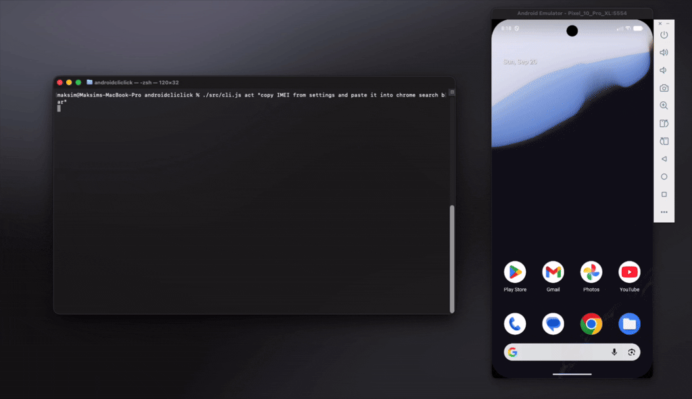
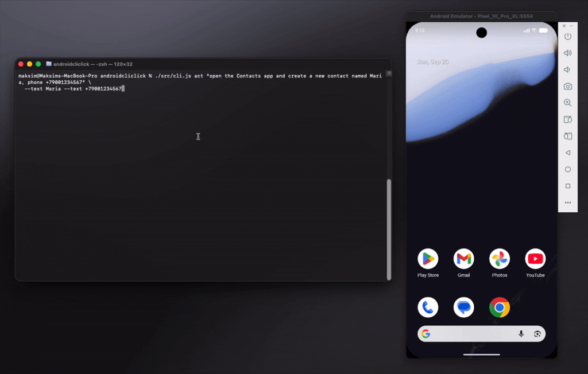

# DroidJev (`droidjev`)

A fast, screenshot-free Android emulator clicker powered by
[TypeSafe](https://docs.typesafe.ai)'s **jev** (System One) model.

You give it a natural-language goal; it dumps the **view hierarchy**, asks jev
which indexed element advances the goal, taps it via `adb`, verifies the screen
changed, and repeats until the goal is achieved. One CLI call per goal. A
powered-off emulator is fine — it auto-boots the first AVD.

## Demo

```bash
droidjev act "copy the IMEI from settings and paste it into chrome search bar"
```



```bash
droidjev act "open the Contacts app and create a new contact named Maria, phone +79001234567" --text Maria --text +79001234567
```



## Prerequisites

1. **Node.js ≥ 20** — required for everything; droidjev has zero npm
   dependencies.
   Install: `brew install node` · `nvm install 20` · [nodejs.org](https://nodejs.org).
   Verify: `node -v` prints `v20` or newer.
2. **`adb`** (Android platform-tools) — required by every device command.
   Install: `brew install --cask android-platform-tools`.
   Verify: `adb version`.
3. **`android` CLI** — optional; needed only when droidjev must boot an AVD
   itself (no emulator online, `boot`, or `--device <avd>`). Skip it if you
   start emulators yourself.
   Install: [developer.android.com/cli](https://developer.android.com/cli/install).
   Verify: `android emulator list` prints your AVDs.

## Installation

1. **`TYPESAFE_API_KEY`** — only `act` talks to the model.
   Get a key at [docs.typesafe.ai](https://docs.typesafe.ai), then add
   `export TYPESAFE_API_KEY=…` to your shell profile.
2. **droidjev itself** — from npm (zero deps, exactly one package), or try it
   without installing:
   ```bash
   npm install -g droidjev
   npx droidjev devices            # no global install needed
   ```
3. **Verify:** `droidjev devices` — with an emulator up it lists it;
   `no devices online` is fine too (`droidjev boot` boots the first AVD).

The first `snapshot`/`find`/`act` downloads appium-uiautomator2-server
(~21 MB, three APKs) onto the emulator and starts a resident server — see
[How it works](https://github.com/mkruglikov/droidjev/blob/master/docs/how-it-works.md).

## Install the AI skill

`skill/SKILL.md` is the source of an agent skill: plain Markdown, usable by
any agent/harness where skills are folders containing a SKILL.md. Install by
copying it into your agent's skills directory, e.g.:

```bash
mkdir -p ~/.agent/skills/droidjev && cp skill/SKILL.md ~/.agent/skills/droidjev/SKILL.md
```

Or fetch it straight from the repo into your agent's skills directory
(`<AGENT_SKILLS_DIR>` = wherever your agent looks for skills, e.g.
`~/.agent/skills` or `~/.zcode/skills`):

```bash
mkdir -p <AGENT_SKILLS_DIR>/droidjev && curl -fsSL https://raw.githubusercontent.com/mkruglikov/droidjev/master/skill/SKILL.md -o <AGENT_SKILLS_DIR>/droidjev/SKILL.md
```

It teaches agents the fast paths (`start`, `find`), the one-call-per-goal rule
for `act`, and the fallbacks for blocked runs.

## Commands

```
droidjev devices                 list emulators with AVD names (raw adb, ~15ms)
droidjev boot [avd]              ensure an emulator is booted (auto-picks first AVD)
droidjev start <package>         launch an app by package (deterministic, no model)
droidjev snapshot [--grep "…"]   indexed element table of the current screen (no model)
droidjev find "<label>" [--tap]  deterministically search scrollable content top-down
                                 for a label and optionally tap it (~0.6s/iteration,
                                 no tokens); stops as soon as scrolling provably cannot help
droidjev act "<goal>" [flags]    run the agent loop until done/blocked
```

Flags: `--device SERIAL|AVD` · `--text "…"` (repeatable — one per form value, e.g.
`--text Mary --text +79001234567` fills name and phone fields; never guessed) ·
`--max-steps N` (act, default 12) · `--max-iterations N` (find, default 20) ·
`--json` (full trace) · `--no-animations` (disable animations for the run;
restored after).

Exit codes: `0` done/found · `2` not achieved — `status=blocked` with
`blockedReason` `model` (no action sequence can reach the goal, including a
value the goal names that was not passed via `--text`) or
`blind_screen` (the screen exposes no accessibility nodes), or
`status=max_steps` (budget exhausted mid-navigation; the goal may still be
reachable — re-run, decompose, or raise `--max-steps`) · `3` error.

## Documentation

- **[How it works](https://github.com/mkruglikov/droidjev/blob/master/docs/how-it-works.md)** —
  the agent loop, the numbered element table, copy/paste, cross-locale
  matching, and the resident uiautomator2 server.
- **[Speed](https://github.com/mkruglikov/droidjev/blob/master/docs/speed.md)** —
  per-step cost table and where the milliseconds go.
- **[Security model](https://github.com/mkruglikov/droidjev/blob/master/docs/security.md)** —
  API-key handling, subprocess spawning, and model-answer validation.
- **[Known limits](https://github.com/mkruglikov/droidjev/blob/master/docs/known-limits.md)** —
  blind screens, ASCII-only typing, top-down `find`, emulator-first targeting.
- **[Development](https://github.com/mkruglikov/droidjev/blob/master/docs/development.md)** —
  running from a checkout, tests, lint.

## License

MIT License

Copyright (c) 2026 DroidJev contributors

Permission is hereby granted, free of charge, to any person obtaining a copy
of this software and associated documentation files (the "Software"), to deal
in the Software without restriction, including without limitation the rights
to use, copy, modify, merge, publish, distribute, sublicense, and/or sell
copies of the Software, and to permit persons to whom the Software is
furnished to do so, subject to the following conditions:

The above copyright notice and this permission notice shall be included in all
copies or substantial portions of the Software.

THE SOFTWARE IS PROVIDED "AS IS", WITHOUT WARRANTY OF ANY KIND, EXPRESS OR
IMPLIED, INCLUDING BUT NOT LIMITED TO THE WARRANTIES OF MERCHANTABILITY,
FITNESS FOR A PARTICULAR PURPOSE AND NONINFRINGEMENT. IN NO EVENT SHALL THE
AUTHORS OR COPYRIGHT HOLDERS BE LIABLE FOR ANY CLAIM, DAMAGES OR OTHER
LIABILITY, WHETHER IN AN ACTION OF CONTRACT, TORT OR OTHERWISE, ARISING FROM,
OUT OF OR IN CONNECTION WITH THE SOFTWARE OR THE USE OR OTHER DEALINGS IN THE
SOFTWARE.
